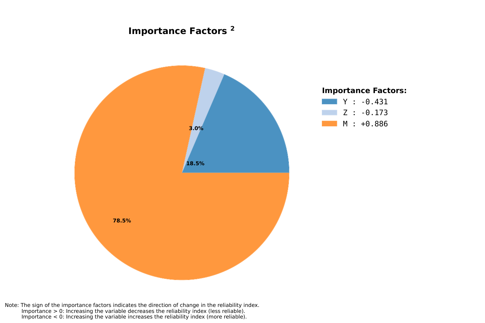

# Analyze Example: AT610 (FORM Only)

This page documents a basic `analyze` run without SORM or Monte Carlo.

Note: Table values are rounded to 4 significant figures for readability. Very small/large values use scientific notation. Refer to the Excel/JSON result files for full precision.
Note: Advanced solver diagnostics (for example `lsf_mult` and bound multipliers) are included in the Excel/JSON outputs.

## Run Context

Problem module:

- `problems/AT610Problem.py`

Recorded result set:

- `results/2026-03-26/13-48-09/AT610-16541.xlsx`
- `results/2026-03-26/13-48-09/AT610-16541.json`
- `results/2026-03-26/13-48-09/AT610-16541.py`
- `results/2026-03-26/13-48-09/AT610-16541.pickle`
- `results/2026-03-26/13-48-09/AT610-16541.pdf`
- `results/2026-03-26/13-48-09/profile-16541.yaml`

Profile and run mode from saved profile:

- Profile used: `default`
- `run_type: analyze`
- `include_sorm: false`
- `include_mc: false`
- `mc_with_is: false`

For results-folder and filename conventions, see [CLI Result Files](../../cli/results-files.md).

Equivalent command shape:

```bash
reliafy analyze <profile>
```

## Profile Customization

This example uses the `default` profile, but analyze behavior is configurable. See [Profile Options Reference](../../profiles/profile-reference.md).

- FORM behavior: `reliability_options.form_xtol`, `form_gtol`, `form_maxiter`, `form_random_start`.
- Analyze toggles: `run_configuration.include_sorm`, `include_mc`, `mc_with_is`.

## Problem File Used

**Source:** Ang, A. H-S. and Tang, W. H., *Probability Concepts in Engineering Planning and Design, Vol. II*, Wiley, 1990, p. 368, Problem 6.10.

`AT610Problem.py` defines:

- Stochastic variables: `Y`, `Z`, `M`
- Distributions: `lognormal`, `lognormal`, `gumbelmax`
- Correlation: `corr(Y, Z) = 0.4`
- Limit state:
  - `R = Y * Z`
  - `L = M`
  - `g = R - L`

## Extracted Results Worksheet Tables

The tables below are transcribed from the `Results` worksheet in `AT610-16541.xlsx`.

### Header Information

| Field | Value |
|---|---|
| Problem | `AT610` |
| Request ID | `a3a7191398bd416abb6a3fff41f16541` |
| Run time | `00 min 00.33 sec` |

### FORM Results

| beta | pf | beta_count | hbeta_count | lsf_count | glsf_count | hlsf_count | nit | min_tries | min_method | lsf_mult |
|---:|---:|---:|---:|---:|---:|---:|---:|---:|---|---:|
| 2.6644 | 0.0038566 | 5120 | 4952 | 7 | 0 | 0 | 10 | 1 | tr_interior_point | 0.01110 |

### Stochastic Variable Inputs and FORM Failure Point Outputs

| var_name | var_type | mean | std | x | u | alpha | importance |
|---|---|---:|---:|---:|---:|---:|---:|
| Y | LogNormal | 40 | 5 | 33.7837 | -1.2942 | -0.4857 | -0.4307 |
| Z | LogNormal | 50 | 2.5 | 47.7543 | -0.4097 | -0.1538 | -0.1728 |
| M | GumbelMax | 1000 | 200 | 1613.3165 | 2.2926 | 0.8605 | 0.8858 |

### User-Defined Correlation Inputs

| var 1 | var 2 | cor_x | cor_z |
|---|---|---:|---:|
| Y | Z | 0.4 | 0.4013 |

### Notes Reported by Reliafy

1. Validation: Stochastic variables definition and limit state function validation required 2 function calls.
2. Validation: Validation of the limit state function's analytic gradient and hessian required 37 function calls.
3. FORM: The lagrange multipliers for the bounds of variable(s) `Y`, `Z` and `M` are active (not zero). If they are large relative to Beta (`2.664`), try truncating the statistical distribution for these variables and check if the reliability index changes significantly.

## Interpretation Snapshot

- This run isolates FORM behavior (no SORM, no Monte Carlo), which is useful for quick reliability screening.
- The reliability index is `beta = 2.6644` with `pf = 3.8566e-03`.
- The failure point importance ranking is dominated by `M`, then `Y`, then `Z`.

## Generated Figures

The PDF result file for this run is saved as `results/2026-03-26/13-48-09/AT610-16541.pdf`.

### Figure 1: Importance Factors

