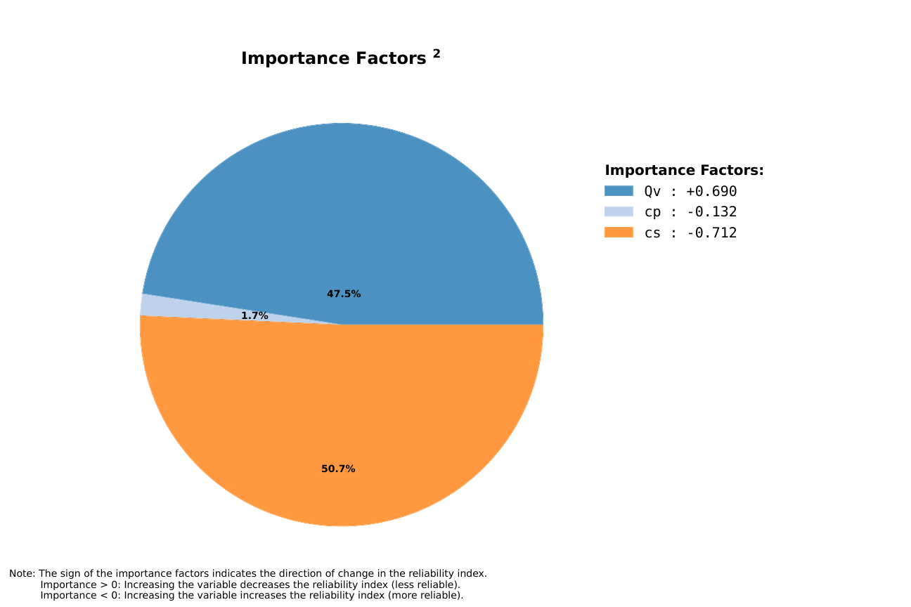
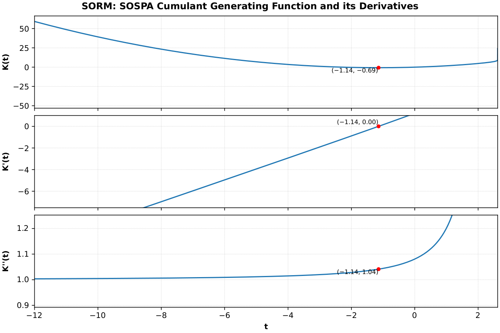
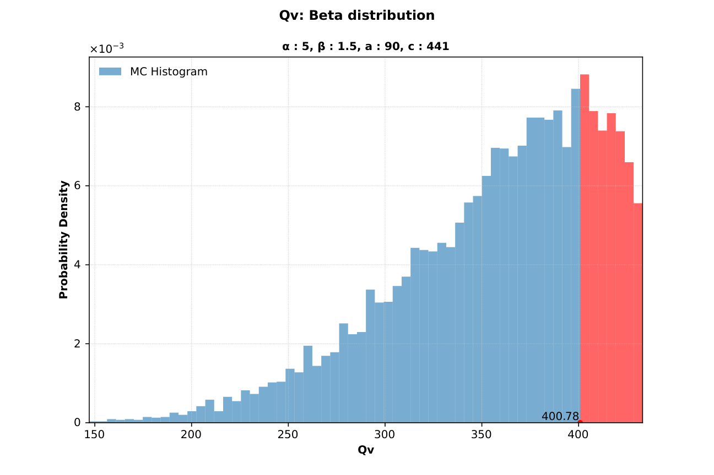
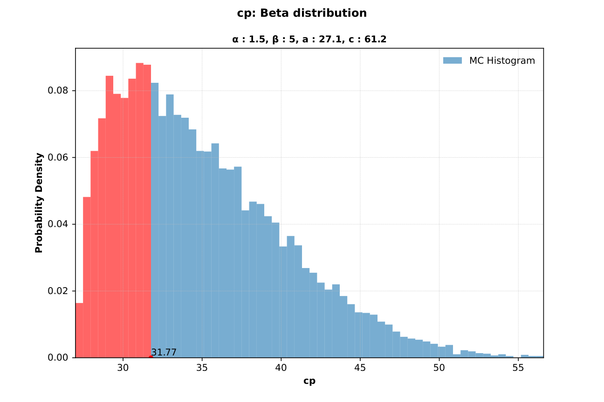
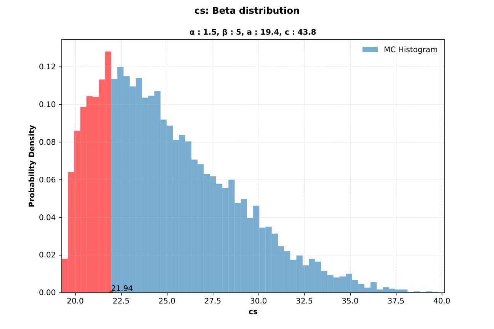
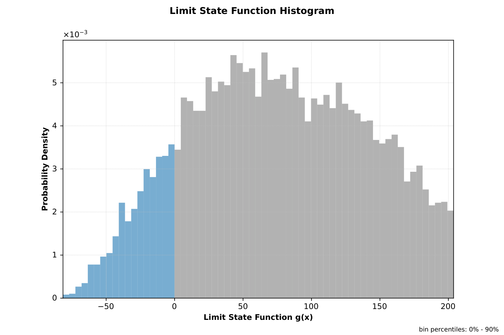
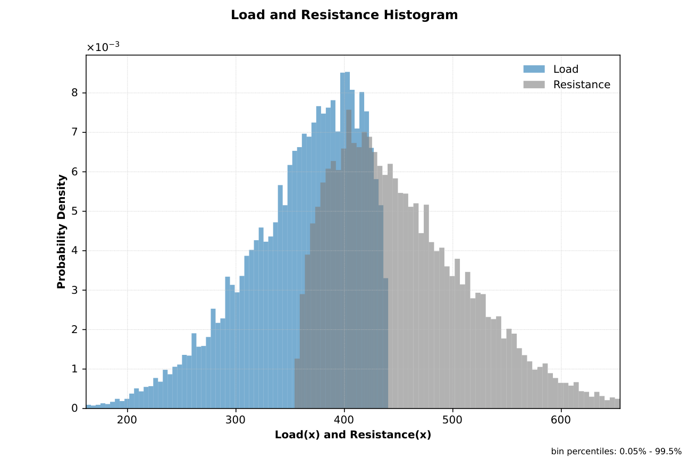

# Analyze Example: Chan3 (SORM + Monte Carlo)

This page documents an `analyze` run with both SORM and Monte Carlo enabled (`-s -m`).

Note: Table values are rounded to 4 significant figures for readability. Very small/large values use scientific notation. Refer to the Excel/JSON result files for full precision.

## Run Context

Problem module:

- `problems/Chan3Problem.py`

Recorded result set:

- `results/2026-03-26/13-49-14/Chan3-55cde.xlsx`
- `results/2026-03-26/13-49-14/Chan3-55cde.json`
- `results/2026-03-26/13-49-14/Chan3-55cde.py`
- `results/2026-03-26/13-49-14/Chan3-55cde.pickle`
- `results/2026-03-26/13-49-14/Chan3-55cde.pdf`
- `results/2026-03-26/13-49-14/profile-55cde.yaml`

Profile and run mode from saved profile:

- Profile used: `default`
- `run_type: analyze`
- `include_sorm: true`
- `include_mc: true`
- `mc_with_is: false`

For results-folder and filename conventions, see [CLI Result Files](../../cli/results-files.md).

Equivalent command shape:

```bash
reliafy analyze <profile> -s -m
```

Option meaning in this command:

- `-s` enables SORM (second-order reliability analysis).
- `-m` enables Monte Carlo simulation.

## Profile Customization

This example uses the `default` profile, but these options are configurable. See [Profile Options Reference](../../profiles/profile-reference.md).

- SORM behavior: `reliability_options.sor_method`, `sor_approximation`, `sor_fit_method`, `sor_fdm`.
- Monte Carlo behavior: `reliability_options.mc_n`, `mc_max_cv`, `mc_seed`, `mc_remove_oob`.
- Analyze toggles: `run_configuration.include_sorm`, `include_mc`, `mc_with_is`.

## Problem File Used

**Source:** Chan, C. L. and Low, B. K., "Practical second-order reliability analysis applied to foundation engineering," *International Journal for Numerical and Analytical Methods in Geomechanics*, first published: 05 July 2011. [→](https://doi.org/10.1002/nag.1057)

`Chan3Problem.py` defines:

- Deterministic variables: `d`, `L`, `a`
- Stochastic variables: `Qv`, `cp`, `cs` (all Beta)
- Correlation: `corr(cp, cs) = 0.5`
- Limit state: `g = Resistance - Load`

## Extracted Results Worksheet Tables

The tables below are transcribed from the `Results` worksheet in `Chan3-55cde.xlsx`.

### Header Information

| Field | Value |
|---|---|
| Problem | `Chan3` |
| Request ID | `501c48c8d22c48228352ac5b39855cde` |
| Run time | `00 min 00.53 sec` |

### Deterministic Variables

| var_name | value |
|---|---:|
| d | 0.5 |
| L | 10 |
| a | 1 |

### FORM Results

| beta | pf | beta_count | hbeta_count | lsf_count | glsf_count | hlsf_count | nit | min_tries | min_method | lsf_mult |
|---:|---:|---:|---:|---:|---:|---:|---:|---:|---|---:|
| 0.9543 | 0.1700 | 5127 | 4959 | 7 | 0 | 0 | 11 | 1 | tr_interior_point | 0.03079 |

### SORM Results

| beta | pf | minR | Ravg | maxR | minabsR | Ks | lsf_class | sor_method | sor_approx | sor_fit_meth | fit_radius | lsf_count |
|---:|---:|---:|---:|---:|---:|---:|---|---|---|---|---:|---:|
| 1.1671 | 0.1216 | 2.6167 | 3.9465 | 8.0246 | 2.6167 | 0.5068 | Convex ellipsoid | SOSPA_H | Paraboloid | Kiureghian | 1 | 20 |

### Monte Carlo Results

| beta | pf | cv | max_cv | size | %_removed | cycles | auto_size | mc_with_is |
|---:|---:|---:|---:|---:|---:|---:|---|---|
| 1.1593 | 0.1232 | 0.02436 | 0.05 | 12000 | 0 | 3 | True | False |

### Stochastic Variable Inputs and FORM Failure Point Outputs

| var_name | var_type | mean | std | x | u | alpha | importance |
|---|---|---:|---:|---:|---:|---:|---:|
| Qv | Beta | 360 | 54 | 400.7793 | 0.6283 | 0.6585 | 0.6895 |
| cp | Beta | 35 | 5.25 | 31.7663 | -0.4540 | -0.4757 | -0.1318 |
| cs | Beta | 25 | 3.75 | 21.9407 | -0.5565 | -0.5832 | -0.7122 |

### Notes Reported by Reliafy

1. Validation: Stochastic variables definition and limit state function validation required 22 function calls.
2. Validation: SORM `reliability_options.sor_fit_method` was changed from `None` to `Kiureghian` because `sor_approximation` is `Paraboloid` and the selected reliability options require a compatible fit method.
3. Validation: Validation of the limit state function's analytic gradient and hessian required 4 function calls.
4. FORM: The lagrange multipliers for the bounds of variable(s) `Qv`, `cp` and `cs` are active (not zero). If they are large relative to Beta (`0.954`), try truncating the statistical distribution for these variables and check if the reliability index changes significantly.
5. Monte Carlo: Completed 3 cycles with `4.00e+03` samples per cycle.

## Interpretation Snapshot

- FORM gives `beta = 0.9543` (`pf ≈ 0.1700`), while SORM and Monte Carlo indicate a slightly less severe reliability level (`beta ≈ 1.16`).
- SORM and Monte Carlo are closely aligned (`pf ≈ 0.1216` vs `0.1232`), which supports consistency of the higher-order/empirical estimate.
- Monte Carlo precision is acceptable for this run (`cv = 0.02436 < 0.05`).

## Generated Figures

The PDF result file for this run is saved as `results/2026-03-26/13-49-14/Chan3-55cde.pdf`.

### Figure 1: Importance Factors



### Figure 2: SORM SOSPA Cumulant Generating Function and Derivatives



### Figure 3: Monte Carlo Histogram - Qv (Beta Distribution)



### Figure 4: Monte Carlo Histogram - cp (Beta Distribution)



### Figure 5: Monte Carlo Histogram - cs (Beta Distribution)



### Figure 6: Histogram of Limit State Function Values



### Figure 7: Load and Resistance Histogram

