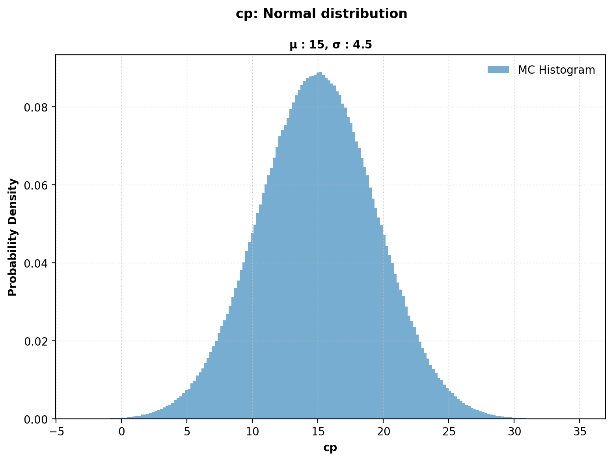
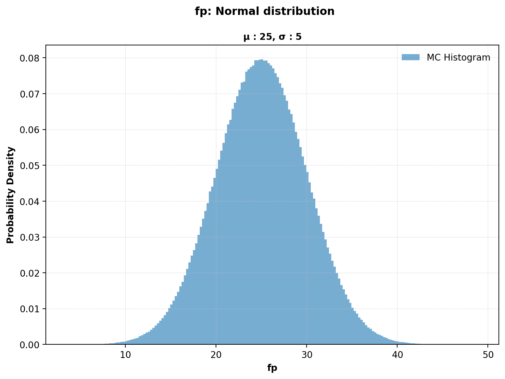
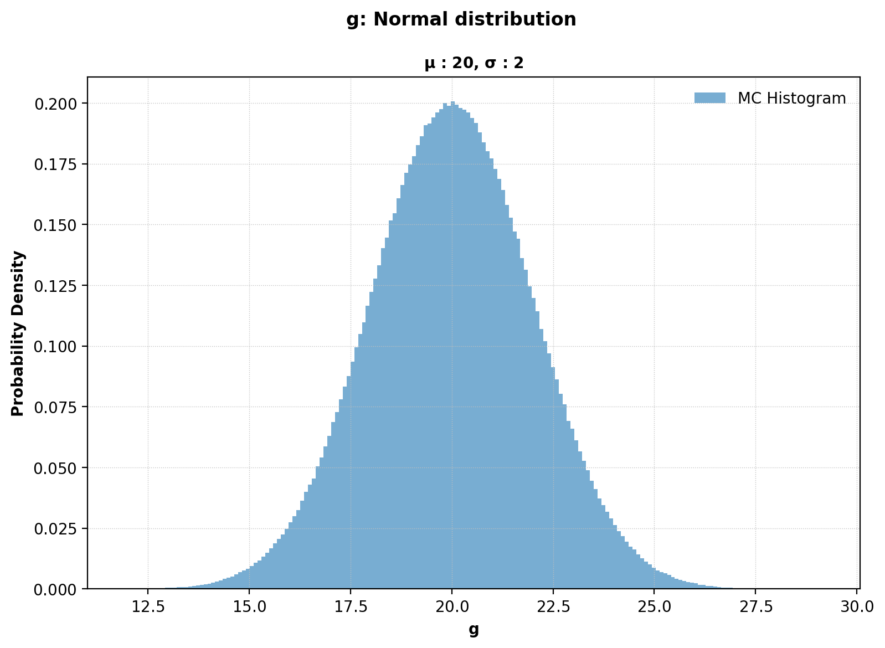
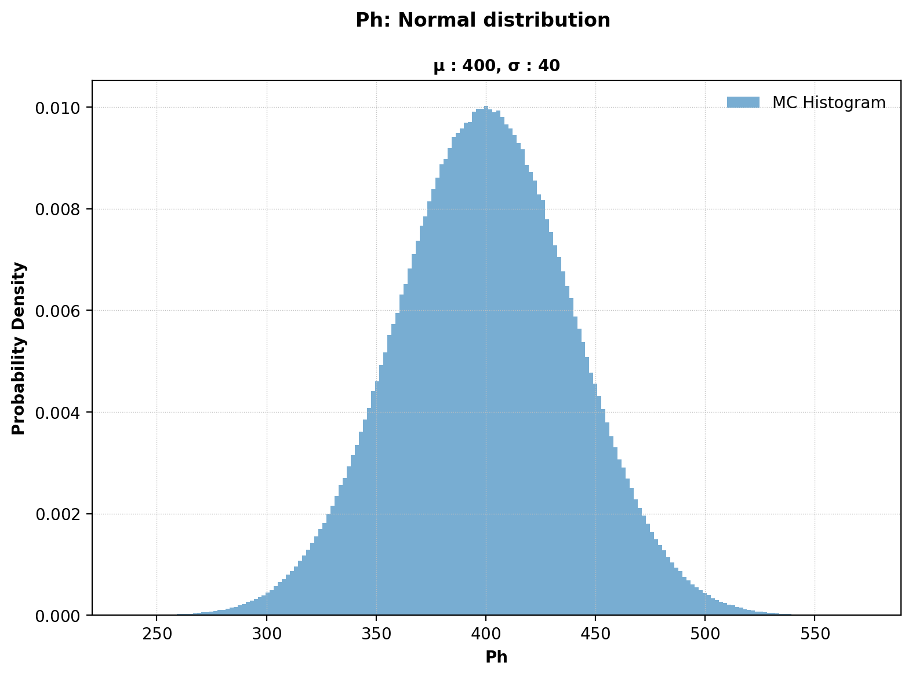
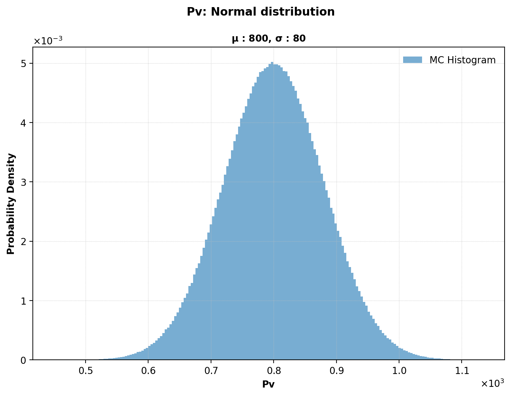
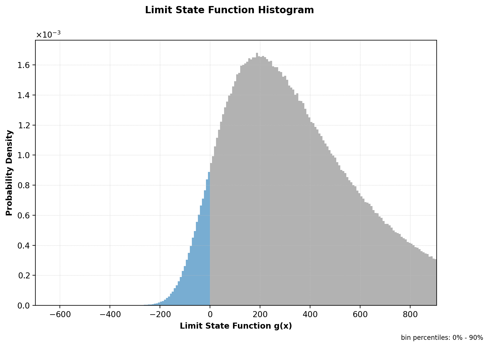
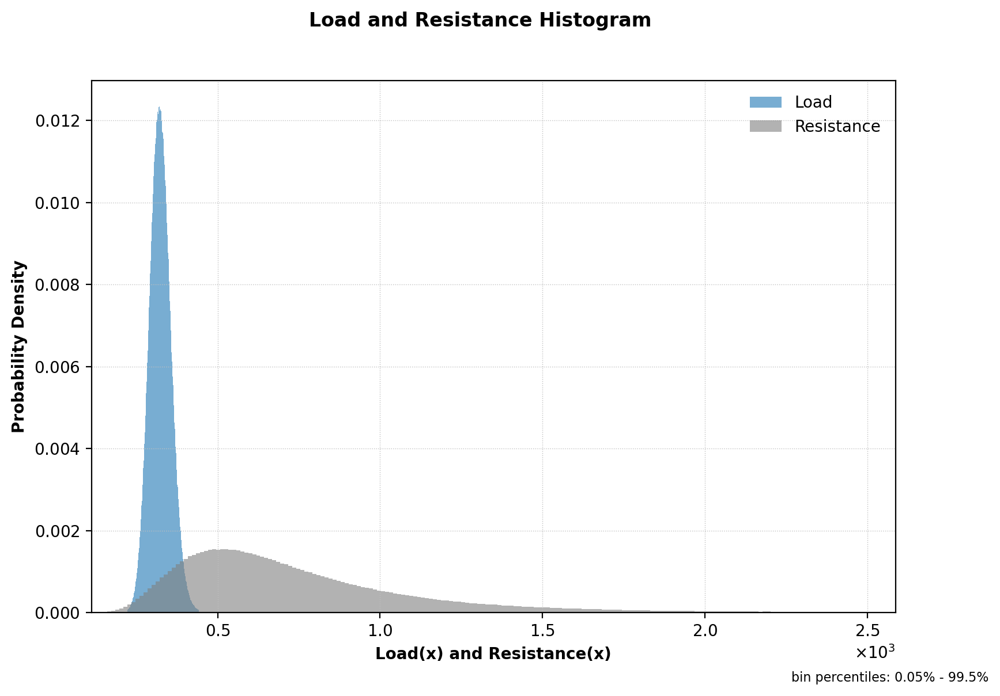

# Simulate Example: Chan2 (Classic Monte Carlo)

This page documents a simulate run in plain Monte Carlo mode (without importance sampling).

Note: Table values are rounded to 4 significant figures for readability. Very small/large values use scientific notation. Refer to the Excel/JSON result files for full precision.

## Run Context

Problem module:

- `problems/problems2/Chan2Problem.py`

Recorded result set:

- `results/2026-04-02/20-31-44/Chan2-a1af3.xlsx`
- `results/2026-04-02/20-31-44/Chan2-a1af3.json`
- `results/2026-04-02/20-31-44/Chan2-a1af3.py`
- `results/2026-04-02/20-31-44/Chan2-a1af3.pickle`
- `results/2026-04-02/20-31-44/Chan2-a1af3.pdf`
- `results/2026-04-02/20-31-44/profile-a1af3.yaml`

Profile and run mode from saved profile:

- Profile used: `default`
- `run_type: simulate`
- `include_mc: true`
- `mc_with_is: false`

For results-folder and filename conventions, see [CLI Result Files](../../cli/results-files.md).

Equivalent command shape:

```bash
reliafy simulate <profile>
```

The `simulate` command without `-i` runs plain (crude) Monte Carlo only.

## Profile Customization

This example uses the `default` profile, but simulate behavior is configurable. See [Profile Options Reference](../../profiles/profile-reference.md).

- Monte Carlo controls: `reliability_options.mc_n`, `mc_max_cv`, `mc_seed`, `mc_remove_oob`.
- Report toggles: `reporting_options.save_plots_to_pdf`, `save_plots_to_pickle`, `save_excel_summary`.

## Problem File Used

**Source:** Chan, C. L. and Low, B. K., "Practical second-order reliability analysis applied to foundation engineering," *International Journal for Numerical and Analytical Methods in Geomechanics*, 2012, vol. 36, no. 11, p. 1387–1409, Problem 2, p. 1397. [→](https://onlinelibrary.wiley.com/doi/full/10.1002/nag.1057)

`Chan2Problem.py` defines:

- Stochastic variables: `cp`, `fp`, `g`, `Ph`, `Pv` — all Normal
- Correlation: full 5 × 5 matrix defined using the `cor` key (see note below)
- Deterministic variables: `B = 5.0`, `L = 25.0`, `D = 1.8`, `h = 2.5`
- `LSFreturnsGradient: False`, `LSFreturnsHessian: False`, `LSFreturnsLandR: True`
- Limit state returns load ($P_v / B'$) and resistance (bearing-capacity formula)

!!! note "Using `cor` vs `cor_list`"
    `Chan2Problem.py` specifies the correlation matrix as a full **n × n list of lists** under the `cor` key.
    This is an alternative to `cor_list`, which accepts a flat list of `[var1, var2, value]` pairs.
    If neither `cor` nor `cor_list` is supplied, Reliafy assumes zero correlation for all variables.
    Either key may be used; the full matrix form is convenient when many off-diagonal correlations are non-zero.

```python
"StochasticVariables": {
    "name": ["cp", "fp", "g", "Ph", "Pv"],
    "type": ["normal", "normal", "normal", "normal", "normal"],
    "cor": [
        [1.0, -0.5,  0.0,  0.0, 0.0],
        [-0.5, 1.0,  0.5,  0.0, 0.0],
        [0.0,  0.5,  1.0,  0.0, 0.0],
        [0.0,  0.0,  0.0,  1.0, 0.5],
        [0.0,  0.0,  0.0,  0.5, 1.0],
    ],
    "mean": [15.0, 25.0, 20.0, 400.0, 800.0],
    "std":  [4.5,  5.0,  2.0,  40.0,  80.0],
},
```

Because `LSFreturnsLandR: True`, the CLI generates a **Load and Resistance Histogram** in addition to the per-variable and LSF histograms.

## Extracted Results Worksheet Tables

The tables below are transcribed from the `Results` worksheet in `Chan2-a1af3.xlsx`.

#### Header Information

| Field | Value |
|---|---|
| Problem | `Chan2` |
| Request ID | `c89975be9921407491d307b104ea1af3` |
| Run time | `00 min 03.51 sec` |

#### Deterministic Variables

| var_name | value |
|---|---:|
| B | 5 |
| L | 25 |
| D | 1.8 |
| h | 2.5 |

#### Stochastic Variables Definition

| var_name | var_type | mean | std | param1 | param2 |
|---|---|---:|---:|---:|---:|
| cp | Normal | 15 | 4.5 | 15 | 4.5 |
| fp | Normal | 25 | 5 | 25 | 5 |
| g | Normal | 20 | 2 | 20 | 2 |
| Ph | Normal | 400 | 40 | 400 | 40 |
| Pv | Normal | 800 | 80 | 800 | 80 |

#### Monte Carlo Results

| beta | pf | cv | max_cv | size | %_removed | cycles | auto_size | mc_with_is |
|---:|---:|---:|---:|---:|---:|---:|---|---|
| 1.5408 | 0.06169 | 0.002252 | 0.05 | 3,000,000 | 0.0007 | 3 | True | False |

#### Monte Carlo Variable Statistics and Correlations

The sampled statistics confirm the input distributions and correlation structure.

| var_name | mean | std | %_oob | cor(cp) | cor(fp) | cor(g) | cor(Ph) | cor(Pv) |
|---|---:|---:|---:|---:|---:|---:|---:|---:|
| cp | 15.0023 | 4.5010 | 0 | 1.0000 | −0.4994 | 0.0003 | −0.0007 | −0.0004 |
| fp | 24.9984 | 5.0013 | 0 | −0.4994 | 1.0000 | 0.4997 | 0.0000 | 0.0002 |
| g | 20.0017 | 1.9998 | 0 | 0.0003 | 0.4997 | 1.0000 | −0.0005 | 0.0001 |
| Ph | 399.944 | 39.978 | 0 | −0.0007 | 0.0000 | −0.0005 | 1.0000 | 0.4998 |
| Pv | 799.836 | 79.992 | 0 | −0.0004 | 0.0002 | 0.0001 | 0.4998 | 1.0000 |

#### Notes Reported by Reliafy

1. Validation: Stochastic variables definition and limit state function validation required 1 function call.
2. Monte Carlo: Completed 3 cycles with `1.00e+06` samples per cycle.
3. Monte Carlo: Detected 21 NaN values in the limit state function out of `3.00e+06` samples. Review the list of code warnings and update the limit state function to address their source.
4. Monte Carlo: If a large fraction of values are invalid, consider adjusting the statistical distributions of the variables, truncating them to finite lower (`lb`) and upper (`ub`) bounds, and defining constraints on the variables to avoid invalid results.

### Interpretation Snapshot

- `beta = 1.541`, `pf = 6.17%` — a relatively low reliability index for a bearing-capacity problem with correlated soil parameters.
- The coefficient of variation (`cv = 0.00225`) is well below `max_cv = 0.05`, indicating high MC precision with 3 million samples.
- The sampled correlation matrix closely matches the targets: `cor(cp, fp) ≈ −0.500`, `cor(fp, g) ≈ 0.500`, `cor(Ph, Pv) ≈ 0.501`.
- A small number of NaN results (21 out of 3,000,000) were detected. These typically arise from geometric degeneration in the bearing-capacity formula (e.g., `B' ≤ 0` due to large eccentricity). They do not invalidate the result at this sample size.
- Reliafy also reported that if invalid values become more frequent, finite `lb` and `ub` bounds or explicit variable constraints are the first things to revisit.

### Generated Figures

The PDF result file for this run is saved as `results/2026-04-02/20-31-44/Chan2-a1af3.pdf`.
The PNGs below were regenerated from the saved Matplotlib pickle in the same result set so they match the current histogram bin capping used by the API.

#### Figure 1: MC Histogram — `cp`



#### Figure 2: MC Histogram — `fp`



#### Figure 3: MC Histogram — `g`



#### Figure 4: MC Histogram — `Ph`



#### Figure 5: MC Histogram — `Pv`



#### Figure 6: Histogram of Limit State Function Values



#### Figure 7: Load and Resistance Histogram

Generated because `LSFreturnsLandR: True` in the problem file.


