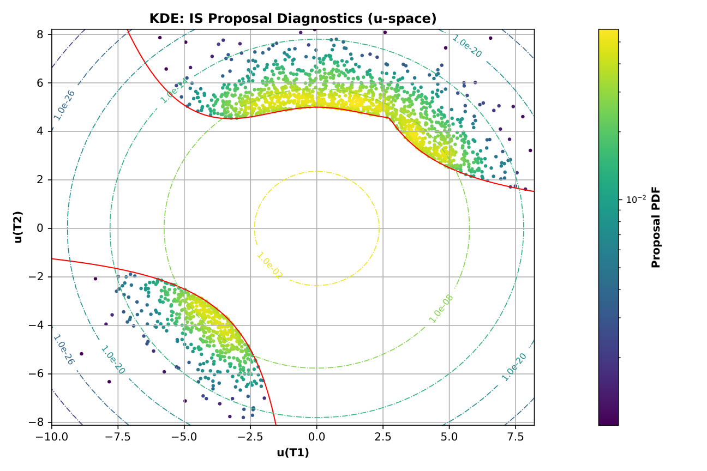
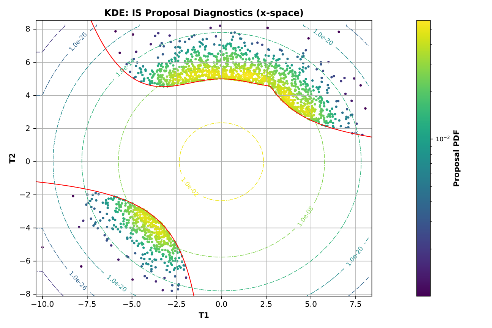
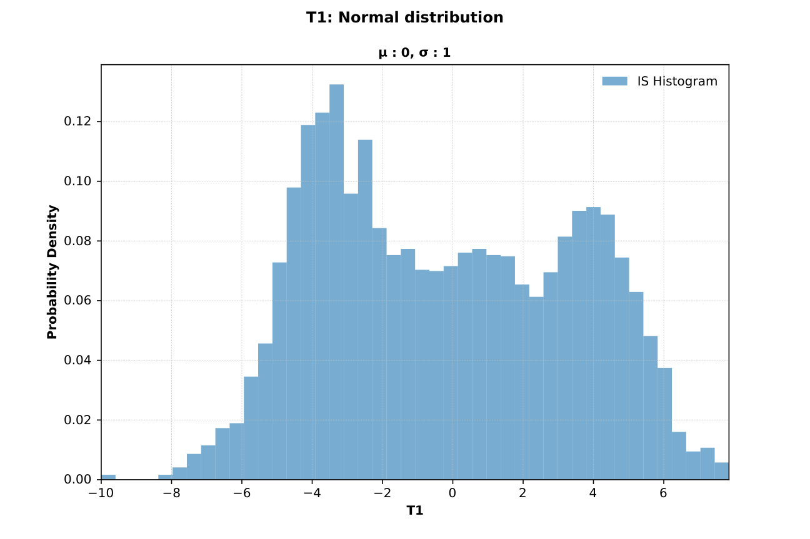
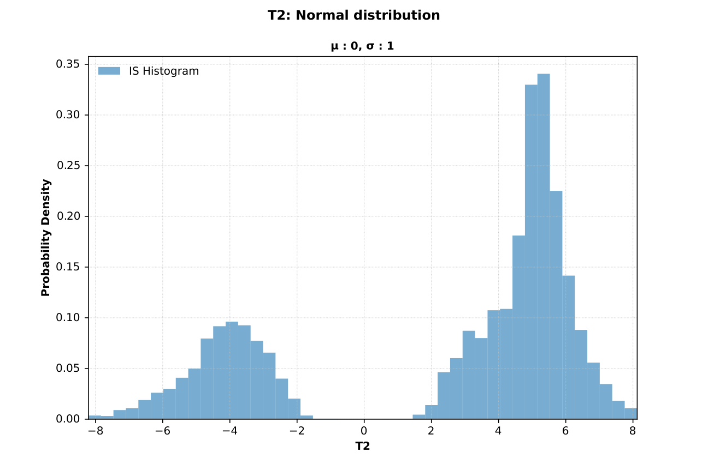
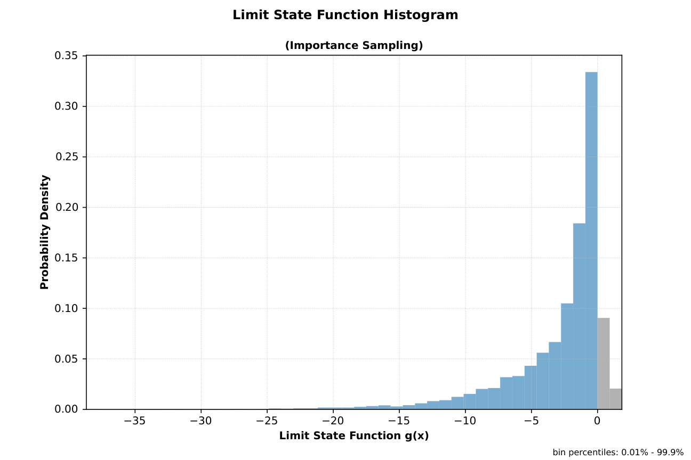

# Simulate Example: AU2 (Importance Sampling)

This page documents a simulate run with importance sampling enabled (`-i`).

Note: Table values are rounded to 4 significant figures for readability. Very small/large values use scientific notation. Refer to the Excel/JSON result files for full precision.

## Run Context

Problem module:

- `problems/AU2Problem.py`

Recorded result set:

- `results/2026-03-16/11-06-54/AU2-42d54.xlsx`
- `results/2026-03-16/11-06-54/AU2-42d54.json`
- `results/2026-03-16/11-06-54/AU2-42d54.py`
- `results/2026-03-16/11-06-54/AU2-42d54.pickle`
- `results/2026-03-16/11-06-54/AU2-42d54.pdf`
- `results/2026-03-16/11-06-54/profile-42d54.yaml`

Profile and run mode from saved profile:

- Profile used: `default`
- `run_type: simulate`
- `include_mc: true`
- `mc_with_is: true`

For results-folder and filename conventions, see [CLI Result Files](../../cli/results-files.md).

Equivalent command shape:

```bash
reliafy simulate <profile> -i
```

The `-i` flag enables **importance sampling (IS)**, which drastically reduces the number of samples needed to estimate very small failure probabilities by concentrating samples near the failure region.

## Profile Customization

This example uses the `default` profile, but simulate behavior is configurable. See [Profile Options Reference](../../profiles/profile-reference.md).

- Importance sampling controls: `run_configuration.mc_with_is` (or `-i`), `reliability_options.is_method`, `is_kde_bandwidth`, `is_fit_samples`, `is_mixture_components`, `is_mcmc_*`.
- Monte Carlo controls: `reliability_options.mc_n`, `mc_max_cv`, `mc_seed`, `mc_remove_oob`.
- Report toggles: `reporting_options.save_plots_to_pdf`, `save_plots_to_pickle`, `save_excel_summary`.

## Problem File Used

**Source:** Au, S. K. and Beck, J. L., "A new adaptive importance sampling scheme for reliability calculations," *Structural Safety*, vol. 21, no. 2, 1999, pp. 135–158. [→](https://people.duke.edu/~hpgavin/risk/Au-1999.pdf)

`AU2Problem.py` defines:

- Stochastic variables: `T1`, `T2` — both standard Normal (μ = 0, σ = 1)
- Deterministic variables: `c = 5`
- `LSFreturnsGradient: False`, `LSFreturnsHessian: False`, `LSFreturnsLandR: False`
- **Series limit state (in-series components)**: The compound limit state is:
  - `g = numpy.minimum(g1, g2)` 
  
  This represents **two components in series** — the system fails when *either* component fails (i.e., when g1 < 0 OR g2 < 0). The `numpy.minimum()` function selects the element-wise minimum, which is essential for handling arrays of samples during Monte Carlo simulation.

- Individual limit state functions:
  - Component 1: `g1 = c - 1 - T2 + numpy.exp(-T1**2/10) + (T1/5)**4`
  - Component 2: `g2 = c**2/2 - T1*T2`

!!! info "Limit states in series and parallel"
    The `simulate` command handles multiple limit states combined using **`numpy.minimum()` (series)** and **`numpy.maximum()` (parallel)** and any combination of both. This example demonstrates the series pattern with `numpy.minimum()`. Use `numpy.maximum()` for parallel (redundant) components where the system fails only when all components fail.
    
    **Important:** Use the element-wise functions **`numpy.minimum()`** and **`numpy.maximum()`**. Do **not** use Python's built-in `min()` and `max()`, and do **not** use NumPy's reduction functions `numpy.min()` and `numpy.max()`, because during Monte Carlo simulation the component limit-state values are arrays of sample values and this operation requires element-wise comparison.

- `ISplot` key defined — required for IS diagnostics plots

!!! note "`ISplot` key"
    The `ISplot` key works like `LSFplot` and `RFADplot`: it specifies the axis variables and plot extents used to render the IS proposal distribution diagnostics. When running with `-i`, the CLI uses `ISplot` to produce the **IS Proposal Diagnostics** figures (both u-space and x-space views). If `ISplot` is absent, the diagnostics plots will not be generated.
    
    **Important:** If samples from the proposal distribution fall outside the specified plot limits, the axis ranges will be automatically expanded to include all samples. This ensures the entire sampled region is visible in the diagnostics plots.

```python
"ISplot": {
    "x_var": "T1",
    "x_lim": [-5.0, 5.0],
    "y_var": "T2",
    "y_lim": [-5.0, 5.0],
},
```

## Extracted Results Worksheet Tables

The tables below are transcribed from the `Results` worksheet in `AU2-42d54.xlsx`.

#### Header Information

| Field | Value |
|---|---|
| Problem | `AU2` |
| Request ID | `cfcb942355da4179b9b48eb4dfa42d54` |
| Run time | `00 min 08.93 sec` |

#### Deterministic Variables

| var_name | value |
|---|---:|
| c | 5 |

#### Stochastic Variables Definition

| var_name | var_type | mean | std | param1 | param2 |
|---|---|---:|---:|---:|---:|
| T1 | Normal | 0 | 1 | 0 | 1 |
| T2 | Normal | 0 | 1 | 0 | 1 |

#### Monte Carlo Results (with Importance Sampling)

| beta | pf | cv | max_cv | size | %_removed | cycles | auto_size | mc_with_is | method | bandwidth | fit_samples |
|---:|---:|---:|---:|---:|---:|---:|---|---|---|---:|---:|
| 4.7775 | 8.873e−7 | 0.02978 | 0.05 | 6,000 | 8.333% | 3 | True | True | kde | 0.2817 | 2,000 |

Key IS parameters:

- **method**: `kde` — the IS proposal distribution was fitted as a kernel density estimate.
- **bandwidth**: `0.2817` — KDE bandwidth used for the proposal.
- **fit_samples**: `2,000` — number of samples drawn near the failure region to fit the proposal.

#### Monte Carlo Variable Statistics and Correlations (IS-weighted)

!!! warning "IS-weighted statistics"
    Because importance sampling re-weights each sample, the tabulated means and standard deviations reflect the **proposal distribution**, not the original input distributions. This is expected behavior.
    
    Similarly, the histogram plots in **Figures 3, 4, and 5** display the re-weighted samples and thus show the characteristics of the proposal distribution, not the original input distributions.

| var_name | mean | std | %_oob | cor(T1) | cor(T2) |
|---|---:|---:|---:|---:|---:|
| T1 | −0.2182 | 3.5806 | 0 | 1.0000 | 0.5670 |
| T2 | 2.3820 | 4.2807 | 0 | 0.5670 | 1.0000 |

#### Notes Reported by Reliafy

1. Validation: Stochastic variables definition and limit state function validation required 4 function calls.
2. Monte Carlo: Creation of importance sampling proposal distribution required 109,980 calls to the limit state function.
3. Monte Carlo: Completed 3 cycles with `2.00e+03` samples per cycle.
4. Monte Carlo: 0.03% of `T1` and 0.05% of `T2` values were not finite (NaN, inf, complex) out of `6.00e+03` samples and were excluded from the Monte Carlo statistics.
5. Monte Carlo: Load and resistance histograms are not available because `LSFreturnsLandR: False`, so the limit state function returns empty load/resistance placeholders.

### Interpretation Snapshot

- The failure probability is very small (`pf ≈ 8.87 × 10⁻⁷`, `beta ≈ 4.78`), making plain Monte Carlo impractical — it would require on the order of 10⁸ samples for reliable estimation. Importance sampling achieves good precision with only 6,000 weighted samples.
- The `cv = 0.0298` is below `max_cv = 0.05`, confirming adequate IS precision for this run.
- The IS proposal construction required ~110,000 LSF evaluations to locate and characterize the failure region before the weighted sampling phase began.
- The IS-weighted variable statistics (`T1` mean ≈ −0.22, `T2` mean ≈ 2.38) clearly reflect bias toward the failure region, which is expected and correct.
- No load/resistance histogram is generated because `LSFreturnsLandR: False`, so `L` and `R` are returned as empty placeholders.

### Generated Figures

The PDF result file for this run is saved as `results/2026-03-16/11-06-54/AU2-42d54.pdf`.

#### Figure 1: IS Proposal Diagnostics (u-space)

The KDE proposal distribution in standard-normal space. Contour lines show the proposal PDF; the failure region boundary is visible.



#### Figure 2: IS Proposal Diagnostics (x-space)

The same proposal distribution plotted in original variable space (`T1`, `T2`).



#### Figure 3: IS Histogram — `T1`



#### Figure 4: IS Histogram — `T2`



#### Figure 5: Limit State Function Histogram (Importance Sampling)



